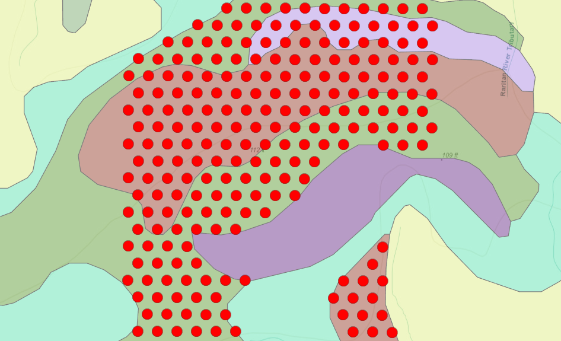

.row[
.col-7[
.title[
###Duke Farms Carbon Project.
]
 

.subtitle[
#### <span style="color: red;">Duke Fields - Impact of land use and soil series on soil carbon stock</span>
##### Project update, 19-22 March 2021
]
.author[
##### Daniel Gimenez, Professor.<br/>Stephanie Murphy, Dr.<br/>Ewan Oleghe, Dr.
]

.affiliation[
##### Department of Environmental Sciences <br> Rutgers, The State University of New Jersey
]

]

.col-5[

.logo[
```{r echo = FALSE}
knitr::include_graphics("figures/df_1.jpeg")
```
]
<br>
<br>
---
Slides:<br> xxxxx slides

Data set:<br> [**CLICK HERE TO DOWNLOAD**](https://github.com/ewanoleghe/Duke-farms/blob/main/Data_150.xlsx)


]

]


---
### Part 1: Sampling

---
##### 1.1. Field Sampling

--
###### 1.1.1.) ...  landuse

```{r echo = FALSE, out.width="70%"}
knitr::include_graphics("map/df.png")
```

---
###### 1.1.2.) ...  and soil series

```{r echo = FALSE, out.width="75%"}
knitr::include_graphics("map/sk1.png")
```

---
##### 1.2.) ...  using a grid

```{r echo = FALSE, out.width="70%"}
knitr::include_graphics("map/sk2.png")
```
---
###### 1.2.1.) ...  with reular equalateral triangular spacing

```{r echo = FALSE, out.width="70%"}

```

Example: Shows 30 meters triangular sampling point laid over different soil series within a grid.
---
##### 1.2.2.) ...  and random sampling

```{r echo = FALSE, out.width="70%"}
knitr::include_graphics("map/sk2.png")
#use random sampling map with points
```
---
### Part 2. Summary & Statistics


---

---
##### Future plans

#### Estimate the vertical distribution of organic carbon to bedrock or maximum penetration distance on different landuse

--
#### Estimate the the impact of landuse on aggregate stability over time.

--
#### Field measurement of soil moisture using TDR sensors

---
### This output is closed first
.details[
```{r}
summary(cars)
```
]

### This output is open first
.details-open[
```{r}
str(cars)
```
]

---
```{r}
summary(grazedSub)
```


