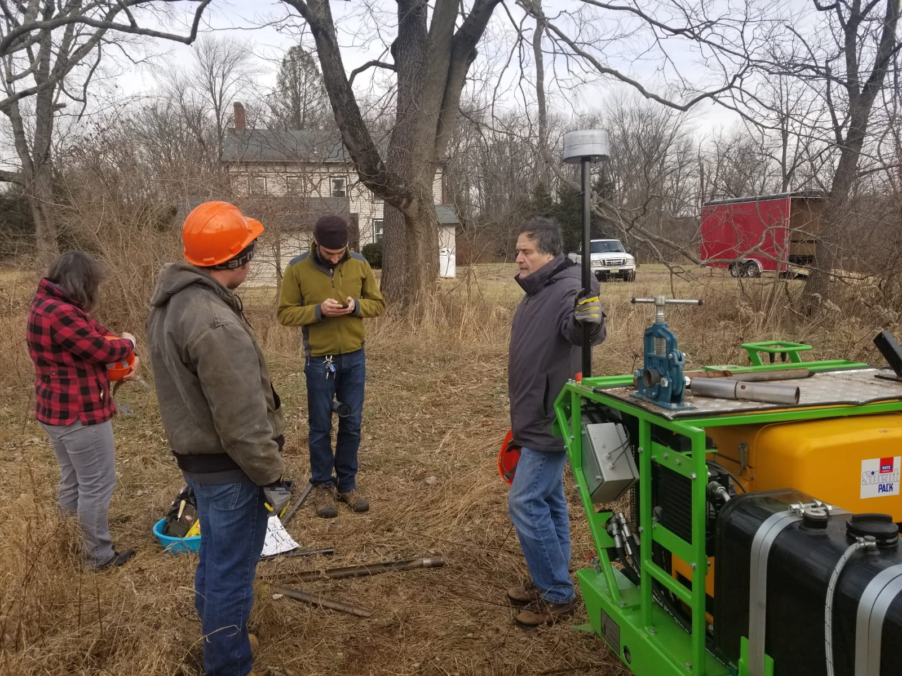
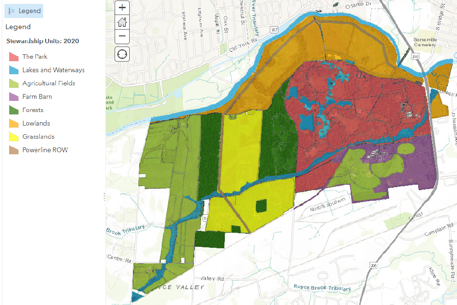
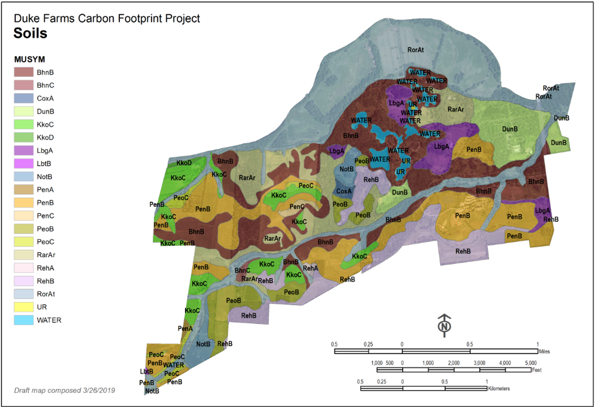
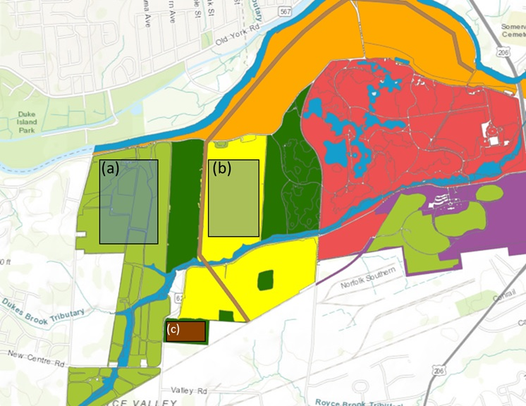
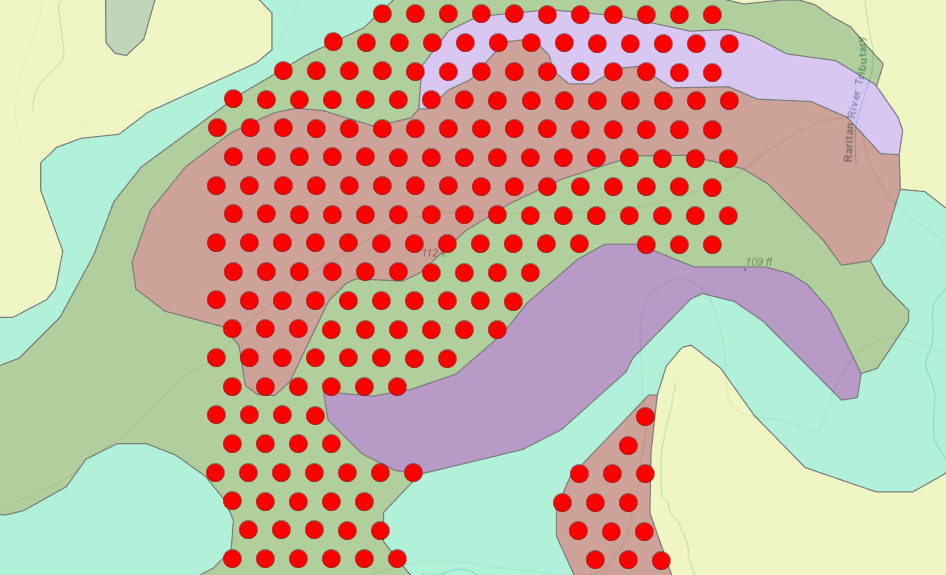

.row[
.col-7[
.title[
###Duke Farms Soil Organic Carbon Study.
]
 

.subtitle[
#### <span style="color: red;">Duke Fields - Impact of land use and soil series on soil carbon stock</span>
##### Project update, 12 April 2021
]
.author[
##### Daniel Gimenez, Professor.<br/>Stephanie Murphy, Dr.<br/>Ewan Oleghe, Dr.
]

.affiliation[
##### Department of Environmental Sciences <br> Rutgers, The State University of New Jersey
]

]

.col-5[

.logo[
```{r echo = FALSE}

```
]
<br>
<br>
---
Slides:<br> 31 slides

Data set:<br> [**CLICK HERE TO DOWNLOAD**](https://ewanoleghe.github.io/science/Data.txt)


]

]


---
class: center, middle
### Part 1: Sampling

---
##### 1.1. Field Sampling

--
###### 1.1.1.) ...  landuse

```{r echo = FALSE, out.width="70%"}

```

---
###### 1.1.2.) ...  and soil series

```{r echo = FALSE, out.width="75%"}

```

---
##### 1.2.) ...  using a grid

```{r echo = FALSE, out.width="70%"}

```
---
###### 1.2.1.) ...  with reular equalateral triangular spacing

```{r echo = FALSE, out.width="70%"}

```

Example: Shows 30 meters triangular sampling point laid over different soil series within a grid.
---
##### 1.2.2.) ...  and random sampling

```{r echo = FALSE, out.width="70%"}

#use random sampling map with points
```
---
class: center, middle
### Part 2. Summary & Statistics


---
##### 2.1.) Total number of samples.
###### 2.1.1.) Grid sampling (Spatial dstribution of soil organic carbon)
Landuse     |  n  |<-    |      |  Soil|series |      |    ->|Total  
------------|-----|------|------|------|-------|------|------|------
            |     | PeoC | PenB |KkoC  |KkoD   |PeoB  | RehB |      
Agriculture |333  |32    | 140  |143   |18     | -    | -    |333   
Grassland   |443	|56    | 201  |186   |  -    | -    | -    |443   
Forest      |206 	|  -   |  -   |  -   |  -    |97    |109   |206  
|           
Total       |982	|  -   | -    | -    | -     | -    | -    |982     


--
###### 2.1.2.) Random sampling (Vertical dstribution of soil organic carbon)
Landuse     |  n  |<-Soil|series|   -> |Total  
------------|-----|------|------|------|-------
            |     | PeoC | PenB |KkoC  |      
Agriculture |136  |41    | 44   |51    |136   
Grassland   |140	|42    | 45   |53    |140   
Wetlands    |60  	|  -   |  -   |  -   |60  
|           
Total       |336	|  -   | -    | -    |336     


---
##### 2.2.) Grid sampling - Summary statistics

###### (2.2.1.) Grassland - Skeet shoot field
###### **Table 1:** Descriptive statistics of soil organic C (Total_C) concentration, nitrogen concentration (Total_N), and organic matter (OM). Values are based on n = 150 samples. Soil properties represent the top 15 cm of Duke Farm's grassland (skeet shoot field) soil.
<!-- <font size="-2"> -->

|           |     |      | N       |      |                 |  |      |  C     |     |                  |  |     |     OM |     |       
------------|-----|------|---------|------|-----------------|--|------|--------|-----|------------------|--|-----|--------|-----|-------
Soil series | n   | Min	 | Median  | Max  | Mean            |  |Min   | Median | Max | Mean             |  |Min	 | Median | Max | Mean  
KkoC        |60 	|0.108 |	0.170	 |0.227 |0.172<sup>a</sup>|  |0.975 |1.684   |2.360|1.673<sup>a </sup>|  |1.681|	2.903 |4.069|2.885<sup>a</sup> 
PenB        |65 	|0.094 |	0.161	 |0.310 |0.161<sup>a</sup>|  |0.767 |1.556   |3.251|1.591<sup>a </sup>|  |1.322|	2.683 |5.605|2.744<sup>a</sup> 
PeoC        |25 	|0.099 |	0.141	 |0.189 |0.144<sup>b</sup>|  |0.853 |1.364   |1.849|1.347<sup>b </sup>|  |1.471|	2.352 |3.188|2.323<sup>b</sup>

where N =  Total Nitrogen, C = Total Carbon and OM = organic matter
<!-- </font> -->
---
###### (2.2.2.) Agriculture - Grazed field
###### **Table 2:** Descriptive statistics of soil organic C (Total_C) concentration, nitrogen concentration (Total_N), and organic matter (OM). Values are based on n = 150 samples. Soil properties represent the top 15 cm of Duke Farm's agriculture (grazed field) soil

|           |     |      |N        |      |       |  |     |   C    |     |       |  |     |   OM   |     |      
------------|-----|------|---------|------|-------|--|-----|--------|-----|-------|--|-----|--------|-----|-------
Soil series | n   | Min	 | Median  | Max  | Mean  |  |Min  | Median | Max | Mean  |  |Min	 | Median | Max | Mean
KkoC        |25 	|0.100 |	0.180	 |0.310 |0.188  |  |0.990|1.800	  |3.120|1.874  |  |1.700|	3.100 |5.380|3.220
KkoD        |13 	|0.130 |	0.220	 |0.390 |0.231  |  |1.240|2.180	  |4.050|2.317  |  |2.140|	3.760 |6.970|3.992 
PenB        |36 	|0.060 |	0.205	 |0.310 |0.192  |  |0.250|2.150	  |3.520|1.952  |  |0.420|	3.705 |6.070|3.366 
PeoC        |26 	|0.120 |	0.210	 |0.390 |0.218  |  |1.260|2.090	  |3.800|2.199  |  |2.170|	3.600 |6.540|3.790

where N =  Total Nitrogen, C = Total Carbon and OM = organic matter

---
###### (2.2.3.) Forest
###### **Table 3:** Descriptive statistics of soil organic C (Total_C) concentration, nitrogen concentration (Total_N), and organic matter (OM). Values are based on the 1st sample set (n = 50). Soil properties represent the top 15 cm of Duke Farm's agriculture (xxxx forest) soil

|           |     |      |N        |      |       |  |     |   C    |     |       |  |     |   OM   |      |      
------------|-----|------|---------|------|-------|--|-----|--------|-----|-------|--|-----|--------|------|-------
Soil series | n   | Min	 | Median  | Max  | Mean  |  |Min  | Median | Max | Mean  |  |Min	 | Median | Max  | Mean
PeoB        |21 	|0.082 |	0.266	 |0.496 |0.272  |  |0.897|3.739	  |7.422|3.986  |  |1.547|	6.447 |12.797|6.872
RehB        |29 	|0.055 |	0.259	 |0.430 |0.246  |  |0.429|3.654	  |6.696|3.482  |  |0.740|	6.300 |11.545|6.004 

where N =  Total Nitrogen, C = Total Carbon and OM = organic matter

---
###### **Table 2:** Analysis of variance for soil organic C (Total_C) concentration, nitrogen concentration (Total_N), and organic matter (OM) for Duke Farm's grassland (skeet shoot field) soil n = 150.
									
Parameters|          |df  |Sum Sq|Mean Sq|F value|Pr(>F) 
----------|----------|----|------|-------|-------|-------
Total_C   |S_Series  |2  	|1.881 | 0.940 |7.492  |0.001***
|         |Residuals |147 |18.450| 0.126 |-      |-      
|       
Total_N   |S_Series  |2	  |0.014 |0.007  |7.481  |0.001***
|         |Residuals |147 |0.137 |0.001  |-      | -      
|        
OM        |S_Series  |2	  |5.590 |2.795  |7.492  |0.001***
|         |Residuals |147 |54.845|0.373  |-      | -      

---
```{r mcPS, echo=FALSE}
mcPS <- read.table("C:/Users/en-y/OneDrive - Rutgers University/Statistics/R Scripts/Duke Field Data/Skeet Shoot/Data/Sample_1.txt", fill = TRUE,  header = T, sep = "\t")

mcPS$distance <- as.character(mcPS$distance)

```

```{r echo = FALSE}
PeoC = subset(mcPS, S_Series== "PeoC");  # sd(PeoC$C)  C, OM, N
KkoC = subset(mcPS, S_Series== "KkoC");  # sd(KkoC$N)  C, OM, N
PenB = subset(mcPS, S_Series== "PenB");  # sd(PenB$OM)  C, OM, N


# FOR PeoC AT DISTANCE 0.5, 15 AND 30
PeoC_05 = subset(PeoC, distance== "0.5");
PeoC_15 = subset(PeoC, distance== "15");
PeoC_30 = subset(PeoC, distance== "30");

library(agricolae)
model<-aov(Total_C ~ distance + S_Series + distance * S_Series + distance:S_Series, data=mcPS)
Sampling.dist <- summary(model)
```


```{r echo = FALSE}
model2<-aov(Total_C ~ S_Series, data=mcPS)
AoVTotal_C <- summary(model2)
```

###### 2.3.) Grassland - Skeet shoot field **ANOVA of sampling distance and soil effects on Total_C:** 
```{r echo = FALSE}
Sampling.dist # Soil series and sampling distance (0.5; 15 and 30 meters) as dependent variables

```

###### 2.4.) Grassland - Skeet shoot field **ANOVA for soil series:** 
```{r echo = FALSE, message=FALSE, warning=FALSE}
AoVTotal_C # Soil series and Total C

```

---
######  2.5.) Grassland - Skeet shoot field **POSTHOC TEST:** 
.pull-left[
```{r echo = FALSE, message=FALSE, warning=FALSE}
# POSTHOC TEST
out <- HSD.test(model,"S_Series", group=TRUE,console=TRUE, # Soil S_Series
                main="IMPACT OF SOIL SERIES ON CARBON CONTENT")
```
]
.pull-right[
###### b.) Soil series:  **Mean ranking - Grassland** 

```{r echo = FALSE}
plot(out)
```
]

---

```{r echo=FALSE}
mcP <- read.table("C:/Users/en-y/Documents/GitHub/science/DataSP.txt", fill = TRUE,  header = T, sep = "\t")

skeetmcP2 = subset(mcP, landuse== "Grassland");
grazedmcP2 = subset(mcP, landuse== "Agriculture");

x <- skeetmcP2$x.axis
y <- skeetmcP2$y.axis
Total_C <- skeetmcP2$Total_C

x1 <- grazedmcP2$x.axis
y1 <- grazedmcP2$y.axis
Total_C1 <- grazedmcP2$Total_C

```

```{r  echo = FALSE}
dataS = data.frame(x,y,Total_C)
dataG = data.frame(x1,y1,Total_C1)


```

```{r echo = FALSE}
library(sp)
coordinates(dataS) = ~x+y
coordinates(dataG) = ~x1+y1

```
###### 2.6.)  Spatial plot of soil organic carbon concentration

.pull-left[
##### Grassland
```{r echo = FALSE}
spplot(dataS, "Total_C", colorkey = TRUE, main = "Organic carbon concentrations (n = 150 Random)")

```
]

.pull-right[
##### Agriculture
```{r echo = FALSE}
spplot(dataG, "Total_C1", colorkey = TRUE, main = "Organic carbon concentrations (n = 150 Random)")

```
]
---
class: center, middle
### Part 3. Spatial Study

---
###### 3.1.) **Compute undirected (isotropic) empirical semivariogram**

```{r mData, echo=FALSE, message=FALSE, warning=FALSE}
## Read data to vector mc1 read.delim

mData <- read.table("C:/Users/en-y/Documents/GitHub/science/Data.txt", fill = TRUE,  header = T, sep = "\t")

skeetSub = subset(mData, landuse== "Grassland");
grazedSub = subset(mData, landuse== "Agriculture");
grazedSub30 = subset(grazedSub, Sam_Dist== "30");

library(gstat)

var1 <- variogram(Total_C ~ 1, ~x.axis + y.axis, cutoff = 480, width = 55, data = skeetSub)
var2 <- variogram(Total_C ~ 1, ~x.axis + y.axis, cutoff = 480, width = 55, data = grazedSub30)

```
###### 3.1a.) R codes to calculation number of pairs for undirected (isotropic) empirical semivariogram


````markdown
`r ''````{r setup, include=FALSE}
# Group by landuse - subset
skeetSub = subset(mData, landuse== "Grassland");
grazedSub = subset(mData, landuse== "Agriculture");

*library(gstat)

*var1 <- variogram(Total_C ~ 1, ~x.axis + y.axis, cutoff = 480, width = 55, data = skeetSub)
*var2 <- variogram(Total_C ~ 1, ~x.axis + y.axis, cutoff = 480, width = 55, data = grazedSub)

```

---
###### 3.1b.) **Compute undirected (isotropic) empirical semivariogram**

.pull-left[
###### Grassland
```{r echo = FALSE, message=FALSE, warning=FALSE}
plot(var1, plot.numbers = TRUE, xlab = "Distance", ylab = "Semivariance", cex = 1, cex.axis = 2, xlim=c(0, 550), ylim=c(0.0, 0.25))
```
]
.pull-right[
##### Agriculture

```{r echo = FALSE, message=FALSE, warning=FALSE}
plot(var2, plot.numbers = TRUE, xlab = "Distance", ylab = "Semivariance", cex = 1, cex.axis = 2, xlim=c(0, 550), ylim=c(0.0, 0.6))
```
]
###### **Figure 1:** Undirected semivariogram of Total_C for Grassland and Agriculture fields. 

---
###### 3.2.) compute semivariogram model based on the empiral semivariogram**


```{r echo=FALSE, message=FALSE, warning=FALSE}
mod1 <- fit.variogram(var1, vgm(psill = NA, "Exp", range = NA, 1), fit.sills = TRUE, fit.ranges = TRUE, fit.method = 1)
mod2 <- fit.variogram(var2, vgm(psill = NA, "Exp", range = NA, 1), fit.sills = TRUE, fit.ranges = TRUE, fit.method = 1)
```
###### 3.2a.) show nugget, psill and range of the semivariogram (EXP) model

.pull-left[
###### Grassland
```{r echo=FALSE, message=FALSE, warning=FALSE}
mod1
```
 

######  (weighted) sum of squared errors of the fitted model
```{r echo=FALSE, message=FALSE, warning=FALSE}
attr(mod1, "SSErr")

```
]

.pull-right[
###### Agriculture
```{r echo=FALSE, message=FALSE, warning=FALSE}
mod2
```
 

###### (weighted) sum of squared errors of the fitted model
```{r echo=FALSE, message=FALSE, warning=FALSE}
attr(mod2, "SSErr")

```

]
---
<!-- --- #fit plot -->
###### 3.3.) Fit of theoretical semivariograms to those empirical semivariograms

.pull-left[
###### Grassland
```{r echo=FALSE}
plot(var1, plot.numbers = TRUE, model = mod1, xlab = "Distance", ylab = "Semivariance", xlim=c(0, 550), ylim=c(0.0, 0.25), pch = 19,
     bg = "lightgray", col = "black",  lwd = 0.9, cex = 1.5)

```

]

.pull-right[
###### Agriculture -replace with grazed
```{r echo=FALSE}
plot(var2, plot.numbers = TRUE, model = mod2, xlab = "Distance", ylab = "Semivariance", xlim=c(0, 550), ylim=c(0.0, 1.0), pch = 19,
     bg = "lightgray", col = "black",  lwd = 0.9, cex = 1.5)

```

]

---

<!--  CONVERT THE DATAFRAME TO SPATIAL POINTS  -->
```{r echo=FALSE}
library(sp)
library(ggplot2)

```
<!-- --- # Create Kriging map for experimental area -->

```{r echo=FALSE}
y <- c(800, 800, 0, 0)
x <- c(0, 500, 500, 0)

xym <- cbind(x, y)
```

```{r echo=FALSE, message=FALSE, warning=FALSE}
# create spatial polygon
library(sp)
p <- Polygon(xym)
ps <- Polygons(list(p), 1)

# create objects of class SpatialPolygons or SpatialPolygonsDataFrame from lists of Polygons objects and
# data.frames
sps <- SpatialPolygons(list(ps))

```

```{r echo=FALSE, message=FALSE, warning=FALSE}
grid_x_y <- as.data.frame(spsample(sps, n = 5000, "regular"))
# set column names to be identical on both datasets, the one containing the original measurement data and
# the one conatinaing the prediction locations
colnames(grid_x_y) <- c("x", "y")
coordinates(grid_x_y) <- ~x + y
```

###### 3.4.) Scatterplot plot of total carbon concentration

.pull-left[
###### Grassland
```{r echo=FALSE, message=FALSE, warning=FALSE}
library("ggplot2")
library("ggthemes")

ggplot(skeetSub, aes(x.axis, y.axis)) +
  geom_point(aes(size=Total_C), color="blue", alpha=3/4) +
  labs(x="m", y="m", title = NULL, subtitle = NULL, caption = NULL, tag = NULL,
       size="Grassland \n \ntotal \norganic carbon") +
  coord_equal() +
  theme_few()
```
]

.pull-right[
###### Agriculture
```{r echo=FALSE, message=FALSE, warning=FALSE}
ggplot(grazedSub, aes(x.axis, y.axis)) +
  geom_point(aes(size=Total_C), color="blue", alpha=3/4) +
  labs(x="m", y="m", title = NULL, subtitle = NULL, caption = NULL, tag = NULL,
       size="Agriculture \n \ntotal \norganic carbon") +
  coord_equal() +
  theme_few()
```
]

```{r echo=FALSE, message=FALSE, warning=FALSE}
rData <- read.table("C:/Users/en-y/Documents/GitHub/science/Data.txt", fill = TRUE,  header = T, sep = "\t")

skeetR = subset(rData, landuse== "Grassland");
grazedR = subset(rData, landuse== "Agriculture");
grazedR30 = subset(grazedR, Sam_Dist== "30");
```

```{r echo=FALSE, message=FALSE, warning=FALSE}
skeetR <- dplyr::distinct(skeetR) 

coordinates(skeetR) <- ~ x.axis + y.axis

mod1.kriged <- krige((Total_C) ~ 1, skeetR, grid_x_y, model=mod1)

frame_mod1.kriged<-as.data.frame(mod1.kriged)
```

```{r echo=FALSE, message=FALSE, warning=FALSE}
grazedSub30 <- dplyr::distinct(grazedSub30) # REMOVES DUPLICATED GRID POINTS
coordinates(grazedSub30) <- ~ x.axis + y.axis

mod2.kriged <- krige((Total_C) ~ 1, grazedSub30, grid_x_y, model=mod2)

frame_mod2.kriged<-as.data.frame(mod2.kriged)
```

---

###### 3.5.) Kriging & Predict carbon content for each field

###### 3.5a.) using ordinary kriging
.pull-left[
###### Grassland

```{r echo=FALSE, message=FALSE, warning=FALSE}
ggplot(frame_mod1.kriged, aes(x=x, y=y)) +
  geom_tile(aes(fill=var1.pred)) + coord_equal() +
  scale_fill_distiller(palette = "Spectral", limits=c(0,3.5), direction = 1)+
  labs(x="x", y="y", title = NULL, subtitle = NULL, caption = NULL, tag = NULL,
       fill="total \ncarbon") +
  annotate("text", label = "Grassland", x = 50, y = 820.5, color = "black")+
  theme_few()

```
]

.pull-right[
###### Agriculture
```{r echo=FALSE, message=FALSE, warning=FALSE}
ggplot(frame_mod2.kriged, aes(x=x, y=y)) +
  geom_tile(aes(fill=var1.pred)) + coord_equal() +
  scale_fill_distiller(palette = "Spectral", limits=c(0,4.5), direction = 1)+
  labs(x="x", y="y", title = NULL, subtitle = NULL, caption = NULL, tag = NULL,
       fill="total \ncarbon") +
  annotate("text", label = "Agriculture", x = 50, y = 820.5, color = "black")+
  theme_few()

```
]

---
class: center, middle
### Part 4. Elevation & Maps

---
###### 4.1.) **Relationship between elevation and total organic carbon**

.pull-left[
###### Grassland

```{r echo = FALSE, message=FALSE, warning=FALSE}
## Read data to vector mc1 read.delim

skeetSub = subset(mData, landuse== "Grassland");
grazedSub = subset(mData, landuse== "Agriculture");


library("ggplot2")
library("ggthemes")
PlotSkt <- ggplot(skeetSub, aes(x=Elevation, y=Total_C, color=S_Series, shape=S_Series)) +
  geom_point() + 
  geom_smooth(method=lm, se=FALSE, fullrange=TRUE)+
  theme_few()
PlotSkt
```
]
.pull-right[
##### Agriculture

```{r echo = FALSE, message=FALSE, warning=FALSE}
library(ggplot2)
PlotGrz <- ggplot(grazedSub, aes(x=Elevation, y=Total_C, color=S_Series, shape=S_Series)) +
  geom_point() + 
  geom_smooth(method=lm, se=FALSE, fullrange=TRUE)+
  theme_few()

PlotGrz
```
]

---
###### 4.2.) **Relationship between elevation and total nitrogen**

.pull-left[
###### Grassland

```{r echo = FALSE, message=FALSE, warning=FALSE}
library("ggplot2")
library("ggthemes")
PloTnSkt <- ggplot(skeetSub, aes(x=Elevation, y=Total_N, color=S_Series, shape=S_Series)) +
  geom_point() + 
  geom_smooth(method=lm, se=FALSE, fullrange=TRUE)+
  theme_few()
PloTnSkt
```
]
.pull-right[
##### Agriculture

```{r echo = FALSE, message=FALSE, warning=FALSE}
library(ggplot2)
PloTnGrz <- ggplot(grazedSub, aes(x=Elevation, y=Total_N, color=S_Series, shape=S_Series)) +
  geom_point() + 
  geom_smooth(method=lm, se=FALSE, fullrange=TRUE)+
  theme_few()

PloTnGrz
```
]
---
###### 4.3.) **Relationship between elevation and organic matter**

.pull-left[
###### Grassland

```{r echo = FALSE, message=FALSE, warning=FALSE}
library("ggplot2")
library("ggthemes")
mPlotSkt <- ggplot(skeetSub, aes(x=Elevation, y=OM, color=S_Series, shape=S_Series)) +
  geom_point() + 
  geom_smooth(method=lm, se=FALSE, fullrange=TRUE)+
  theme_few()
mPlotSkt
```
]
.pull-right[
##### Agriculture

```{r echo = FALSE, message=FALSE, warning=FALSE}
library(ggplot2)
mPlotGrz <- ggplot(grazedSub, aes(x=Elevation, y=OM, color=S_Series, shape=S_Series)) +
  geom_point() + 
  geom_smooth(method=lm, se=FALSE, fullrange=TRUE)+
  theme_few()

mPlotGrz
```
]


---
###### Map: Grassland

<!-- # EXTRACT POINTS EITH ELEVATION DATA -->
```{r echo = FALSE}
skeetE <- skeetSub[-c(66:150 ), ]
```

```{r echo = FALSE}
grazedE <- grazedSub[-c(80:150 ), ]
```

```{r echo = FALSE, message=FALSE, warning=FALSE}

library(measurements)
# change the degree symbol to a space
skeetE$Latitude = gsub('° N', ' ', skeetE$Latitude)
skeetE$Longitude = gsub('° W', ' ', skeetE$Longitude)

grazedE$Latitude = gsub('° N', ' ', grazedE$Latitude)
grazedE$Longitude = gsub('° W', ' ', grazedE$Longitude)

```

```{r echo = FALSE}
# CREATE DATAFRAME FOR EACH LANDUSE
lat <- skeetE$Latitude
long<- skeetE$Longitude
c1 = paste(skeetE$Latitude," / ",skeetE$Longitude, "-", skeetE$S_Series)

dSkt <- data.frame(lat,long, c1)

```

```{r echo = FALSE}
# CREATE DATAFRAME FOR EACH LANDUSE
lat <- grazedE$Latitude
long<- grazedE$Longitude
c1 = paste(grazedE$Latitude," / ",grazedE$Longitude, "-", grazedE$S_Series)

dGrz <- data.frame(lat,long, c1)

```


```{r echo = FALSE, message=FALSE, warning=FALSE}
library(sf)
library(mapview)

locations_Sk <- st_as_sf(dSkt, coords = c("long", "lat"), crs = 4326)
locations_Gz <- st_as_sf(dGrz, coords = c("long", "lat"), crs = 4326)

library(gdtools)
```

```{r echo = FALSE}
mapS = mapview(locations_Sk)
mapG = mapview(locations_Gz)
```

```{r echo = FALSE, fig.width=14, fig.height=7.5}
mapS

```
---
##### Map: Agriculture

```{r echo = FALSE, fig.width=14, fig.height=7.5}
mapG

```


---

#### Next Phase 

--
###### Estimate the vertical distribution of organic carbo to bedrock or maximum penetration depth

--
###### Estimate the number of samples required to characterize a field/landuse based on the semivariogram.

--
###### Estimate the impact of landuse and soil types on aggregate stability

--
###### CAST model


---
class: center, middle

# That's all for today

